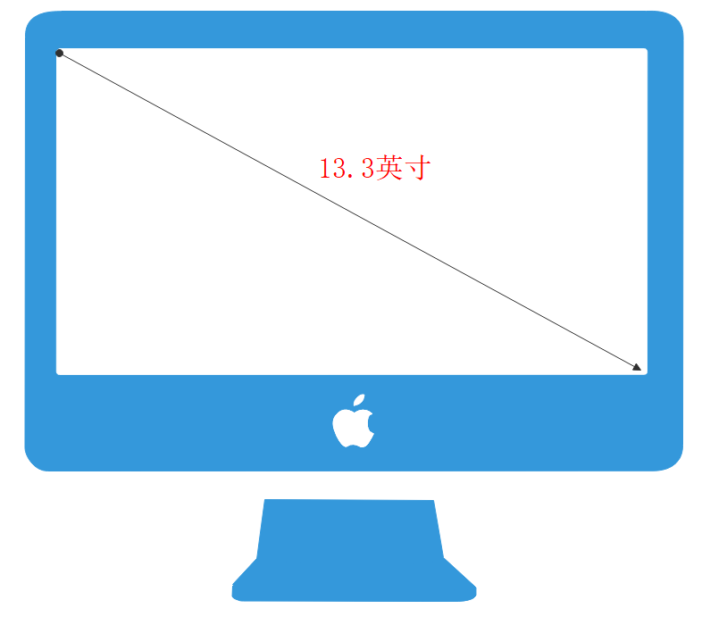
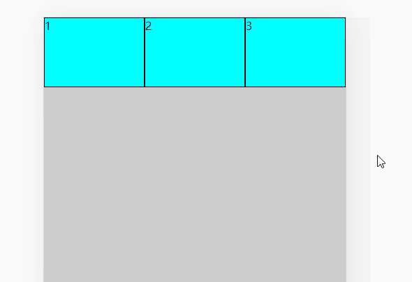

# 浅谈-web屏幕适配的解决方案


就目前看来，web的屏幕适配是贯穿整个前端行业的，如常见的PC端，移动端，响应式，小程序等。


# PC端

## 特点

PC端的屏幕具备以下特点：

1. 屏幕大小一般是大于 `13.3英寸`
2. 用户会经常拖拉浏览器的大小



## 原因

正是因为 PC端上的浏览器大小会经常被改变，而且改变的范围还很大，用户会全屏浏览器，用户也会缩小浏览器到一个很小的值，如600px左右。  所以pc端上如果使用流式布局(百分比布局)，会导致页面很难看。


## 解决

所以，PC端上只能通过**版心布局**来解决这种情况。

- 当屏幕大于版心宽度时，版心居中显示
- 当屏幕小于版心宽度时，屏幕出现一个横向的滚动条，这种方案几乎所有的PC端网站都在采用。


## 案例


## 代码

```html
<!DOCTYPE html>
<html lang="en">

<head>
  <meta charset="UTF-8">
  <title>版心布局</title>
  <style>
    * {
      margin: 0;
      padding: 0;
      box-sizing: border-box;
    }
    html,body{
      height: 100%;
      background-color: #ccc;
    }
    main{
      width: 1200px;
      height: 100%;
      margin: 0 auto;
      font-size: 40px;
      background-color: pink;
    }
    header{
      height: 80px;
      background-color: aqua;
    }
  </style>
</head>

<body>
  <main>
    <header>版心</header>
    <section>内容</section>
  </main>
</body>
</html>
```

## 效果


# 移动端

## 特点

移动端下的屏幕存在以下特点：

- 屏幕相比较于PC端要小
- 浏览器不PC端，随时各种调整大小

## 原因

移动端由于屏幕整体比PC端小，而且也不能出现拖动浏览器来调整大小的情况，所以在移动端上的布局是流式布局最多，其中有些小分支，如固定小版心。

## 解决

**流式布局**，也叫做百分比布局，指的是页面上大部分的容器和元素的宽度都不是定死，可能是 百分比单位，也可能是[rem](https://developer.mozilla.org/zh-CN/docs/Web/CSS/length)单位

## 案例


## 代码

普通的图片和容器，写单位的时候换成 百分比 或者 flex即可。

对于页面中的某些元素，如字体大小，可以使用 淘宝 `flexibile + rem` 的解决方案

[淘宝flexible](https://github.com/amfe/lib-flexible)

### 普通的流式布局

```html
<!DOCTYPE html>
<html lang="en">

<head>
  <meta charset="UTF-8">
  <title>流式</title>
  <meta name="viewport" content="width=device-width, initial-scale=1.0,maximum-scale=1,minimum-scale=1,user-scalable=no">
  <style>
    * {
      margin: 0;
      padding: 0;
      box-sizing: border-box;
    }

    body {
      background-color: #ccc;
    }


    ul {
      list-style: none;
      display: flex;
      height: 100px;
    }

    li {
      flex: 1;
      border: 1px solid #000;
      background-color: aqua;
    }
  </style>
</head>

<body>
  <main>
    <section>
      <ul>
        <li>1</li>
        <li>2</li>
        <li>3</li>
      </ul>
    </section>
  </main>
</body>

</html>
```


### 效果



### 淘宝flexible + rem

> flexible 和flex布局没关系  老婆和老婆饼 也没有关系

这个解决方案是可以和以上的流式布局搭配使用的，rem的作用是主要是针对字体实现 跟随屏幕变化而变化

1. rem css单位，相对长度，它的值等于根标签的字体大小如

   ```html
   
      <style>
       html {
         font-size: 100px;
       }
       div {
         /* 相对于 100px */
         font-size: 1rem;
       }
     </style>
     <div>
       rem单位
     </div>
   ```

   **效果**

   

2. 淘宝flexible

   1. 是手淘团队出的一个处理移动端rem设置的js库
   2. 把根标签的字体大小改成了 当前屏幕的十分之一大小
   3. 根标签的字体大小发生改变了，使用了rem单位的元素或者字体大小也跟着改变


**流程**


#### flexible代码

```html
<!DOCTYPE html>
<html lang="en">
<head>
  <meta charset="UTF-8">
  <title>版心布局</title>
  <meta name="viewport"
    content="width=device-width, initial-scale=1.0,maximum-scale=1,minimum-scale=1,user-scalable=no">
  <script> (function flexible(window, document) { var docEl = document.documentElement; var dpr = window.devicePixelRatio || 1; function setBodyFontSize() { if (document.body) { document.body.style.fontSize = 12 * dpr + "px"; } else { document.addEventListener("DOMContentLoaded", setBodyFontSize); } } setBodyFontSize(); function setRemUnit() { var rem = docEl.clientWidth / 10; docEl.style.fontSize = rem + "px"; } setRemUnit(); window.addEventListener("resize", setRemUnit); window.addEventListener("pageshow", function (e) { if (e.persisted) { setRemUnit(); } }); if (dpr >= 2) { var fakeBody = document.createElement("body"); var testElement = document.createElement("div"); testElement.style.border = ".5px solid transparent"; fakeBody.appendChild(testElement); docEl.appendChild(fakeBody); if (testElement.offsetHeight === 1) { docEl.classList.add("hairlines"); } docEl.removeChild(fakeBody); } })(window, document); </script>
  <style>
    * {
      margin: 0;
      padding: 0;
      box-sizing: border-box;
    }
  </style>
</head>

<body>
  <div>

  </div>
  <script>
    window.onload = function () {
      setFont();
      window.addEventListener("resize", function () {

        setFont();
      })
      function setFont() {
        var div = document.querySelector("div");
        div.style.fontSize = document.querySelector("html").style.fontSize;
        div.innerHTML = "html的字体大小为" + document.querySelector("html").style.fontSize;
      }
    }
  </script>
</body>

</html>
```

#### flexible效果


#### 综合flexible 和 rem

根据以上的特点

- `flexible` 把 **根标签字体大小**改为 屏幕的十分之一
- `rem` 可以根据根标签的字体大小改变而发生改变

得出以下解决方案

1. 假定设计稿的宽度 是 `640px`

2. 根标签的字体大小为 `64px` 也就是 `1 rem = 64px` => `1px=1/64rem`

3. 原设计稿中的div大小为100px，字体大小为100px

4. 将px单位修改为 rem单位

   ```css
   div{
   	width:100px;
   	font-size:100px;
   }
   修改为
   div{
   	width:calc( 100rem / 64 );
   	font-size:calc( 100rem / 64 );
   }
   ```

5. 将设计稿的宽度也抽象出去

   ```css
   div{
   	width:calc( 100rem / 十分之一的设计稿宽度 );
   	font-size:calc( 100rem / 十分之一的设计稿宽度 );
   }
   ```


**完整代码**

```html
<!DOCTYPE html>
<html lang="en">

<head>
  <meta charset="UTF-8">
  <title>版心布局</title>
  <meta name="viewport"
    content="width=device-width, initial-scale=1.0,maximum-scale=1,minimum-scale=1,user-scalable=no">
  <script> (function flexible(window, document) { var docEl = document.documentElement; var dpr = window.devicePixelRatio || 1; function setBodyFontSize() { if (document.body) { document.body.style.fontSize = 12 * dpr + "px"; } else { document.addEventListener("DOMContentLoaded", setBodyFontSize); } } setBodyFontSize(); function setRemUnit() { var rem = docEl.clientWidth / 10; docEl.style.fontSize = rem + "px"; } setRemUnit(); window.addEventListener("resize", setRemUnit); window.addEventListener("pageshow", function (e) { if (e.persisted) { setRemUnit(); } }); if (dpr >= 2) { var fakeBody = document.createElement("body"); var testElement = document.createElement("div"); testElement.style.border = ".5px solid transparent"; fakeBody.appendChild(testElement); docEl.appendChild(fakeBody); if (testElement.offsetHeight === 1) { docEl.classList.add("hairlines"); } docEl.removeChild(fakeBody); } })(window, document); </script>
  <style>
    * {
      margin: 0;
      padding: 0;
      box-sizing: border-box;
    }

    div {
      width: calc(100rem / 64);
      height: calc(100rem / 64);
      font-size: calc(100rem / 64);
      background-color: aqua;
    }
  </style>
</head>

<body>
  <div>

  </div>
  <script>
    window.onload = function () {
      setFont();
      window.addEventListener("resize", function () {

        setFont();
      })
      function setFont() {
        var div = document.querySelector("div");
        div.style.fontSize = document.querySelector("html").style.fontSize;
        div.innerHTML = "html的字体大小为" + document.querySelector("html").style.fontSize;
      }

    }
  </script>
</body>

</html>
```


**最终效果**


## 小版心

小板心的做法其实也是流式布局中的一种，只不过对最外层容器加了一个最大宽度的设置如

```css
main{
	max-width:540px;
}
```

### 参考


# 小程序端

小程序端可以理解特殊的移动端，只不过小程序端不存在 `rem`这个单位，取而代之的是 `rpx` 这个单位，翻译就是响应式像素，功能类似 `rem`

## 特点

小程序中不需要引入淘宝`flexible`这个库，因为内置的 `rpx` 单位就是实现了 `rem + fleixible` 功能。

小程序中，存在 屏幕的宽度 统一为 `750 rpx` 因此：存在以下关系。

| 屏幕宽度 | 换算关系  px 和 rpx    |
| -------- | ---------------------- |
| 750  px  | 1 px = 1 rpx           |
| 375 px   | 1px = 2 rpx            |
| any px   | 1 px  =  any / 750 rpx |

## 代码

如 设计稿为 375px，其中存在一个`view` 宽度高度均为 100px ，字体大小 为 100px

```jsx
    view {
      width: 200rpx;
      height: 200rpx;
      font-size: 200rpx;
      background-color: aqua;
    }
    
    <view> 小程序rpx </view>
```


# [vw 和 vh](https://developer.mozilla.org/zh-CN/docs/Web/CSS/length)

在移动端中，还存在以下单位，也很好用，可以很方便解决问题。

| 单位 | 名称                    |
| ---- | ----------------------- |
| vw   | 100vw 等于 视口的宽度   |
| vh   | 100vh 等于 视口的高度   |
| vMax | vw 和 vh 中的较大的那个 |
| vMin | vw 和 vh 中的较小的那个 |

以上单位 在移动端中，或者在小程序中都支持。

设计稿为  `375px`，存在一个大小为`100px`的`div`，字体大小也为`100px`。

1. `375px  = 100 vw`  那么 `1 px =  100vw / 375` 
2. 因此  `100px =  100vw * 100 / 375`;

## 代码

> 注意 calc的语法比较严格 尤其注意空格

```css
    main {
      background-color: pink;
      width: calc(100vw * 100 / 375);
      height: calc(100vw * 100 / 375);
      font-size: calc(100vw * 100 / 375);
    }
```


# 响应式布局

响应式的概念分为两大类

1. 一种是后端响应式
2. 一种是前端响应式


## 后端响应式

后台服务器根据前端浏览器的`User-Agent`来判断来源请求是PC端还是移动端，然后服务器动态返回PC端页面或者移动端页面。nginx中很容易就出现该功能。京东，天猫，淘宝也是这样子的。

## 前端响应式

主要是指通过媒体查询来实现。

前端写好一套代码 `html + css + javascript` ，就可以冬天的根据屏幕的宽度来改变页面的样式

这种做法体验不是最好，但是却是最小的代码实现了 兼容pc端和移动端。一般是对页面要求不高或者小企业使用。

由于还要兼容到pc端，所以一般做响应式页面 不会用太高级的h5 css3 的技术。

### 案例

如 实现一个 大屏幕下 一行显示**3**列，小屏幕下 一行显示**2**列。

```html
<!DOCTYPE html>
<html lang="en">

<head>
  <meta charset="UTF-8">
  <meta name="viewport" content="width=device-width, initial-scale=1.0">
  <meta http-equiv="X-UA-Compatible" content="ie=edge">
  <title>Document</title>
  <style>
    * {
      margin: 0;
      padding: 0;
      box-sizing: border-box;
    }

    ul {
      overflow: hidden;
    }

    li {
      float: left;
      height: 100px;
      border: 1px solid #000;
      background-color: pink;
    }

    /* 大屏幕 */
    @media screen and (min-width:800px) {
      li {
        width: 33.33%;
      }
    }
    /* 小屏幕 */
    @media screen and (max-width:800px) {
      li {
        width: 50%;
        background-color: lawngreen;
      }
    }
  </style>
</head>

<body>

  <ul>
    <li>1</li>
    <li>2</li>
    <li>3</li>
    <li>4</li>
    <li>5</li>
    <li>6</li>
    <li>7</li>
    <li>8</li>
  </ul>
</body>

</html>
```

### 效果


### 其他

业内要实现响应式布局时，一般会使用 推特公司的 [bootstrap](https://www.bootcss.com) 框架，好评度很高，而且还针对ie8 做了兼容处理。
